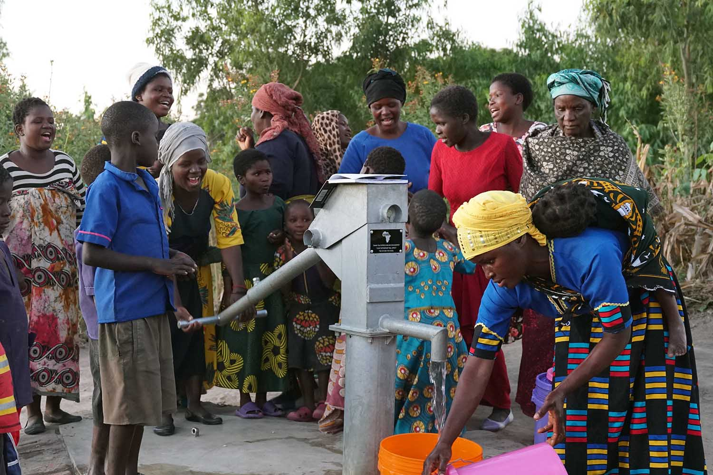
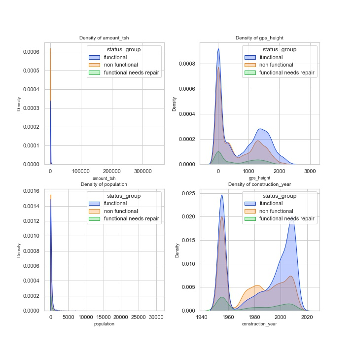
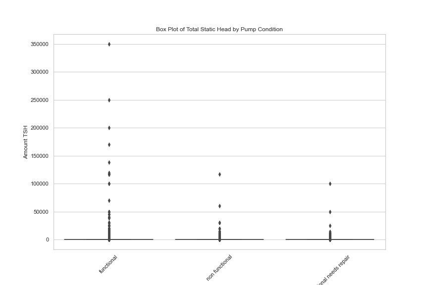
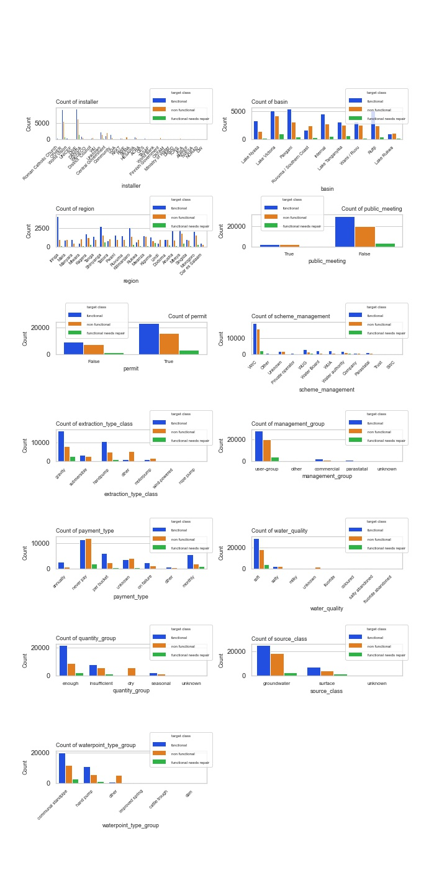
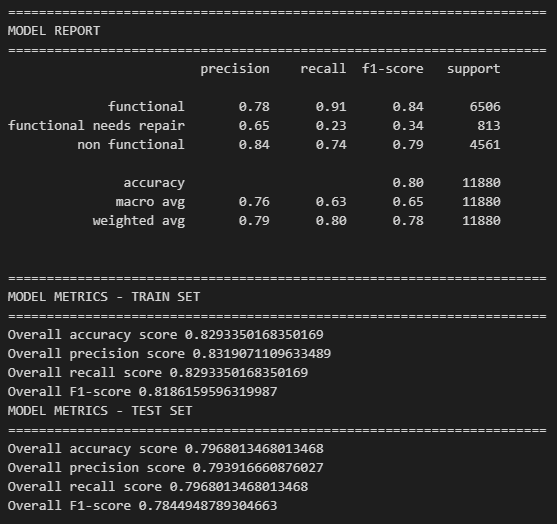
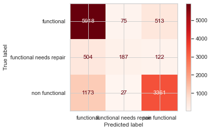

### Project Description

## TANZANIA WELL WATCH ML PREDICTION 

AUTHOR - SHAWN J. IRUNGU

WellWatch ML is a machine learning model for classifying water well functionality in Tanzania, originally developed as part of Taarifa Hackathon hosted at [Driven Data](https://www.drivendata.org/competitions/7/pump-it-up-data-mining-the-water-table/page/23/) where it placed 796 out of 18,373 competitors. This project served as a showcase of my ability to rapidly prototype impactful data science solutions under tight constraints, leveraging techniques like ML methods and use of specific key tools, e.g., Python, Scikit-learn, preprossessing to achieve performance metrics in predicting well status. This project demonstrates my end-to-end problem-solving skills, from hackathon-speed iteration to production-ready refinement.

### Overview
This project seeks to build a Machine Learning classifier algorithm that can predict the condition of a water well (functional, functional-but-needs-repair, and non-functional), using data such as the kind of pump, when it was installed, the installer, the region, and so on.

### Business Understanding
Tanzania is a country in East Africa known for its national parks and wild animals. The World Bank estimates its population at 65 million as of 2022 and its land size is about 947,303 km2 (365,756 sq mi).

The country comprises many lakes, national parks, and in fact, Africa's highest point, Mount Kilimanjaro (5,895 m or 19,341 ft). Northeast Tanzania is mountainous, while the central area is part of a large plateau covered in grasslands.

However, like many other sub-Saharan African countries, Tanzania is a developing country struggling to provide adequate clean water for its bulging population that is growing at 3% per annum.

Extreme poverty rate was 44% in 2022 as the population continued to grow at 3% per year. This means an increasing population is not affording the basic quality of life.

#### GROUND WATER SITUATION IN TANZANIA

According to [Dr. Japhet J. Kashaigili](https://gw-africa.iwmi.org/wp-content/uploads/sites/23/2018/10/Country_Report-Tanzania.pdf) the hydrogeology of Tanzania has not been thoroughly studied and ground water development has concentrated mainly on shallow wells for domestic purposes over a wide part of the country. He also reports that up to 90% of pumps and other equipment used for water extraction fail due to a lack of repair and maintenance.

Various actors, such as the national and regional governments, religious organizations, and foreign cooperation agencies have established many water points around the country but they are hardly enough. What is worse is that a significant number of the water points are in need of repair while others have failed altogether

### Business Problem
[Climate change](https://en.wikipedia.org/wiki/Geography_of_Tanzania) is exacerbating water scarcity in Tanzania, where extreme weather patterns — ranging from destructive rainfall to prolonged droughts — are disrupting water access. Despite these challenges, only 61% of Tanzanian households have access to basic water supply, while just 32% benefit from basic sanitation and 48% from basic hygiene [World Bank](https://www.worldbank.org/en/country/tanzania/publication/tanzania-economic-update-universal-access-to-water-and-sanitation-could-transform-social-and-economic-development). Poor water infrastructure contributes to approximately 31,000 preventable deaths annually, imposing a heavy economic burden on the country.

The cost of water projects remains a critical barrier. A single hand-pump well, serving 600–700 people, requires an investment of $6,000–$8,000, while mechanized systems cost at least $12,000. Worse, up to 90% of water pumps fail prematurely due to inadequate maintenance, leaving communities without reliable access.

To address this crisis, Tanzania must prioritize sustainable installation practices and proactive maintenance of existing water systems. By leveraging data-driven solutions, we can optimize resource allocation and extend the lifespan of water infrastructure. 

I am committed to partnering with the Tanzanian government to tackle this challenge - ensuring clean, safe, and reliable water for millions.

### Business Objective
My main objectives in this project will be:

> To build a Machine Learning classifier that will predict the condition of a water well (functional, functional-but-needs-repair, and non-functional), using data such as the kind of pump, when it was installed, the installer, the region, and so on.

> To help the Government of Tanzania find patterns in functional and non-functional wells, to help influence how new wells are built.

> To find the most important factors that influence whether a pump is functional, functional-but-needs-repair, or non-functional. This can guide the management of new and existing water wells.

### STUDY QUESTIONS
1. Predictive Feasibility
"Can we accurately predict a water pump's operational status (functional, functional-but-needs-repair, or non-functional) using features such as pump type, installation date, installer, geographical region, and related variables?"

2. Key Influencing Factors
"Which 20 features have the strongest correlation with a pump's operational status? How do factors like pump model, maintenance history, or environmental conditions impact functionality?"

3. Geographical Trends
"How are functional, non-functional, and repair-needing pumps distributed across regions? Are there spatial patterns (e.g., clusters of non-functional pumps in arid areas)?"

### DATA UNDERSTANDING
The relevant datasets for have been provided on the Driven Data website which is hosting a competition for this project.
Data for the dependent variable in the test dataset has not been provided, therefore, I will make use of Training set values and Training set labels datasets.
**Training Data Features**
The training dataset contains 59,400 waterpoints in Tanzania and the following 39 features:

| Column           | Description                                                                                       |
|------------------|---------------------------------------------------------------------------------------------------|
| amount_tsh       | Total static head (amount water available to waterpoint)                                      |
| date_recorded    | Date on which the row was recorded                                                       |
| price            | Individual or organization that funded installation of the well                                   |
| gps_height       | The altitude at which the water pump is located                                                   |
| installer        | Individual or organization that installed the well                                                |
| longitude        | Longitude coordinates of the water point                                                          |
| latitude         | Latitude coordinates of the water point                                                           |
| wpt_name         | Name of the waterpoint if there is one                                                            |
| num_private      | Information about this feature is unavailable                                                     |
| basin            | Name of the geographic water basin                  |
| subvillage       | Geographic location                                                                    |
| region           | Geographic location                     |
| region_code      | Coded geographic location                                              |
| district_code    | Coded geographic location                                                                    |
| lga              | Geographic location                                                                          |
| ward             | Geographic location                       |
| population       | Population around the well                                                                     |
| public_meeting   | Boolean data whether public meeting for the water pump was conducted                              |
| recorded_by      | Name of agency which recorded the water pump data                                                 |
| scheme_management| Name of scheme that manages the waterpoint                    |
| scheme_name      | Name of scheme under which the water point was established                                       |
| permit           | Boolean data describing whether the water point has permit available or not                  |
| contruction_year | Year in which the water point was constructed                                             |
| extraction_type  | The kind of extraction the waterpoint uses                       |
| extraction_type_group        | The kind of extraction the waterpoint uses                               |
| extraction_type_class      | The kind of extraction the waterpoint uses                                            |
| management       | Name of organization/authority that manages the water point                    |
| managememt_group | Category of organization/authority that manages the water point                       |
| payment          | Describes how residents pay for water                                       |
| payment_type     | Describes how residents pay for water                  |
| water_quality    | The quality of water                                                                    |
| quality_group    | The quality of water                     |
| quantity         | The quantity of water                                               |
| quantity_group   | The quantity of water                                                                    |
| source           | The source of water                                                                          |
| source_type      | The source of water                       |
| source_class     | The source of water                                                                     |
| waterpoint_type  | The nature of water point                           |
| waterpoint_type_group  | The nature of water point                        |  

### Methodology

#### Data Understanding and Cleaning
I explored the datasets to understand their schema, size, data types, and examine the presence of invalid or inconsistent data such as missing values, duplicates, placeholders, and outliers.

#### Data Analysis
I analyzed the relationship between the continuous and categorical predictor variables and pump condition, which is the response variable.

#### Data Visualization
I used various visualization methods such as bar plots, histograms, scatter plots, and Folium maps to display descriptive statistics and facilitate interpretation.

#### Machine Learning Modelling
I built different machine learning models and evaluated their performance to pick the best based on performance scores and whether it was fitting the data appropriately (without underfitting or overfitting).

### Findings

#### Relationship Between Pump Functionality and Continuous Variables

For the total static head feature (amount_tsh), waterpoints with zero static head have the highest density of pumps overall. Also, among the three pump classes at this point, non-functional pumps have the highest density followed by functional pumps. Functional-needs-repair pumps are the least.

For the population feature, waterpoints located in areas with zero population have the highest density of pumps overall. Also, among the three pump classes at this point, non-functional pumps have the highest density followed by functional pumps. Functional-needs-repair pumps are the least.

For the construction year feature, the year 1955 has a high density of pumps, but these are the year 0 rows which I imputed with 1955. The KDE plot also shows that the density of functional pumps is higher among the newest pumps while non-functional pumps are higher among the older pumps, from around 1965 to 1990.

#### Total Static Head against Pump Condition

we see that the more spending on well , the well is functional and the less spendings the well is either non-functional or needs repair

#### Relationship Between Pump Functionality and Categorical Variables

From the different visualizations of categorical variables, we notice that some classes of categories are more popular than others. For example, Iringa and Kilimanjaro regions have the highest number of pumps. The never-pay payment scheme is most popular and over 40,000 out of 59,400 wells have soft water quality.

From the distribution of pump functionality class for each class of a categorical variable, we notice that the functional pumps are more frequent than functional-needs-repair and non-functional pumps.

A notable deviation from this trend is the never-pay class of the payment-type category, where non-functional pumps are more than the other classes of pumps.

### Final ML Model

We conclude that XGBoost will be final model since the difference in metrics between train set and test set is 0.04 which is a tiny effect to say that our model is overfitting. It performed well with high metrics than other models, has an accuracy score of 0.7968 and a f1 score of 0.7845 on test set, an accuracy score of 0.829 and a f1 score of 0.819 on train set, we are going to use F1 score as our metric since our target classes were imbalanced and thus 0.7845 is a high scoring from all models we created.

### AUC & ROC Curve analysis comparing all models

From the above visuals, XGBoost shows to be the best model since the 3 class shows a fpr tpr tradeoff close to 1.0 at TPR(true positive rate) compared to other models.

Comparing Test set and Train test, Logistic Regression model shows underfitting while Tuned Decision Tree model doesn`t neither shows overfitiing nor underfitting compared to both train set and test set, however its metrics are so low and this makes us decide to select XGBoost which has high metrics.

We conclude that XGBoost will be final model since the difference in metrics between train set and test set is 0.04 which is a tiny effect to say that our model is overfitting. It performed well with high metrics than other models, has an accuracy score of 0.7968 and a f1 score of 0.7845 on test set, an accuracy score of 0.829 and a f1 score of 0.819 on train set, we are going to use F1 score as our metric since our target classes were imbalanced and thus 0.7845 is a high scoring from all models we created.

Below are XGBoost metrics comparison

MODEL METRICS - TRAIN SET 

Overall accuracy score 0.8293350168350169

Overall precision score 0.8319071109633489

Overall recall score 0.8293350168350169

Overall F1-score 0.8186159596319987

MODEL METRICS - TEST SET

Overall accuracy score 0.7968013468013468

Overall precision score 0.793916660876027

Overall recall score 0.7968013468013468

Overall F1-score 0.7844948789304663

### 20 Important Features from our Model

Some of the top features influencing a prediction include:

i.) quantity-group (the quantity of water)

ii.) The water point type

iii.) The extraction type class

iv.) The basin

v.) scheme management

vi.) The installer

vii.) payment type

### CONCLUSION
For the total static head feature (amount_tsh), waterpoints with zero static head have the highest density of pumps overall. Also, among the three pump classes at this point, non-functional pumps have the highest density followed by functional pumps. Functional-needs-repair pumps are the least.

From the box plot of total_static_head vs. pump condition, we can see that the pumps having tsh above approx.125,000 are all functional. High static head may be an important feature because the higher the tsh the higher the probabilty of a pump being functional.

For the population feature, waterpoints located in areas with zero population have the highest density of pumps overall. Also, among the three pump classes at this point, non-functional pumps have the highest density followed by functional pumps. Functional-needs-repair pumps are the least.

For the construction year feature, the year 1955 has a high density of pumps, but these are the year 0 rows which I imputed with 1955. 

A KDE (kernel density estimation) plot shows that the density of functional pumps is higher among the newest pumps while non-functional pumps are higher among the older pumps, at 1955, 1980 and around 2010.

### RECOMMENDATION
I advise the Goverment of Tanzania to apply my final model in predicting the condition of well pumps across Tanzania. It will help them to correctly predict the actual condition of each pump at at least 80% success rate.

The government will need to implement and operationalize a payment scheme for the water points, having observed that the sites where people never pay for water had the highest frequency of non-functional pumps.

Finding out if there is more data that can balance the target classes. The current classes are imbalanced with the most frequent class comprising 37.2% of the data while the least class comprises only 4.42%. This affected the prediction score of the least class compared to the other classes. Availability of more data that can balance the classes would realize much better prediction scores.

